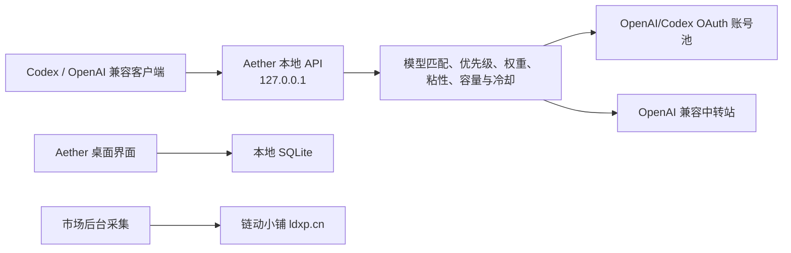
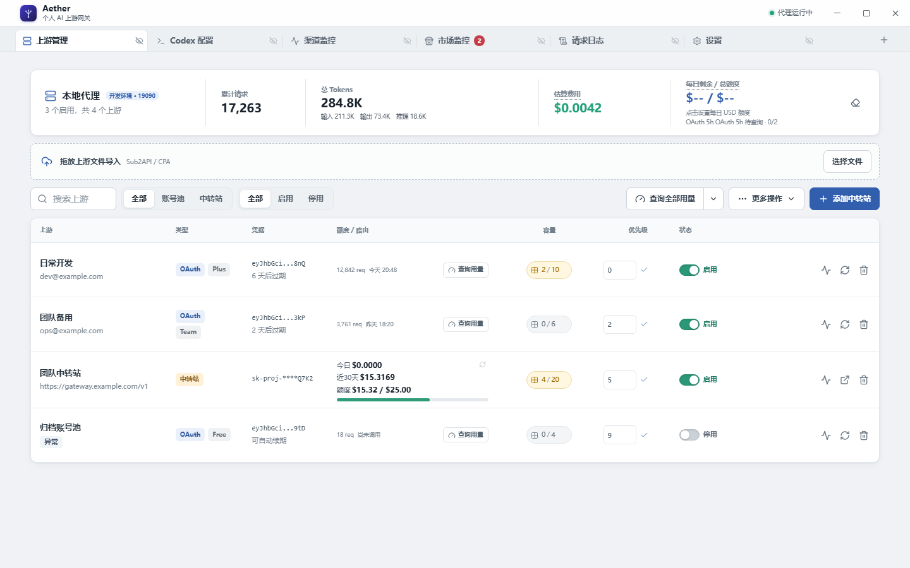
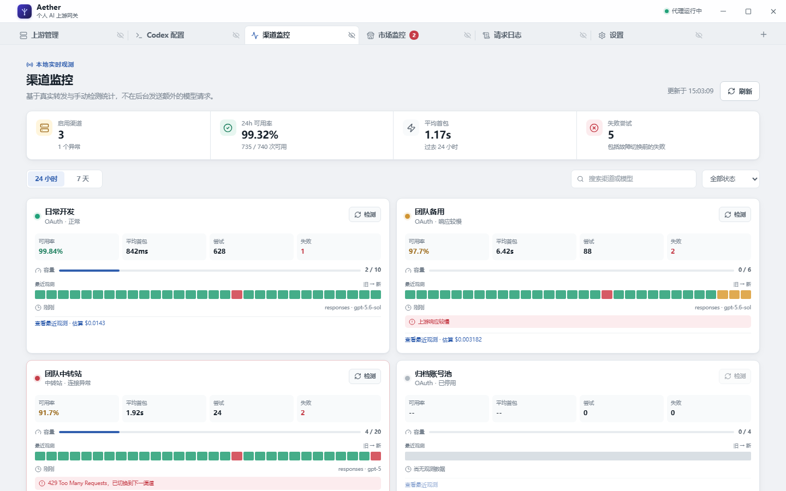
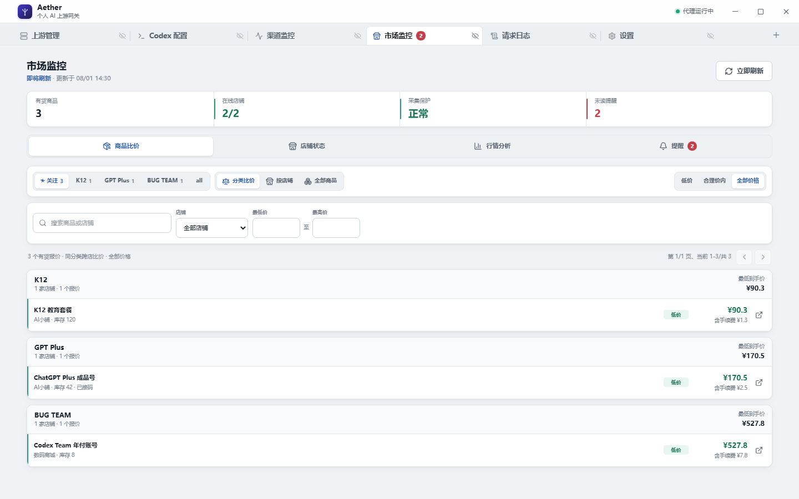
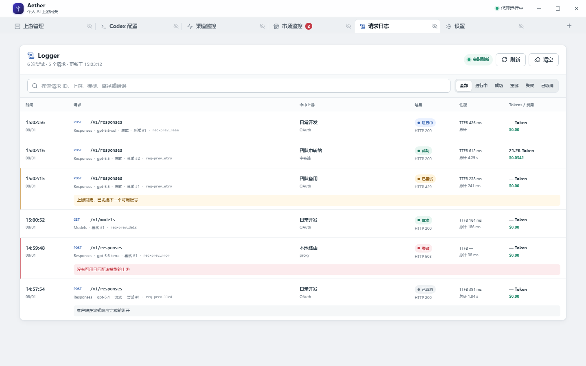
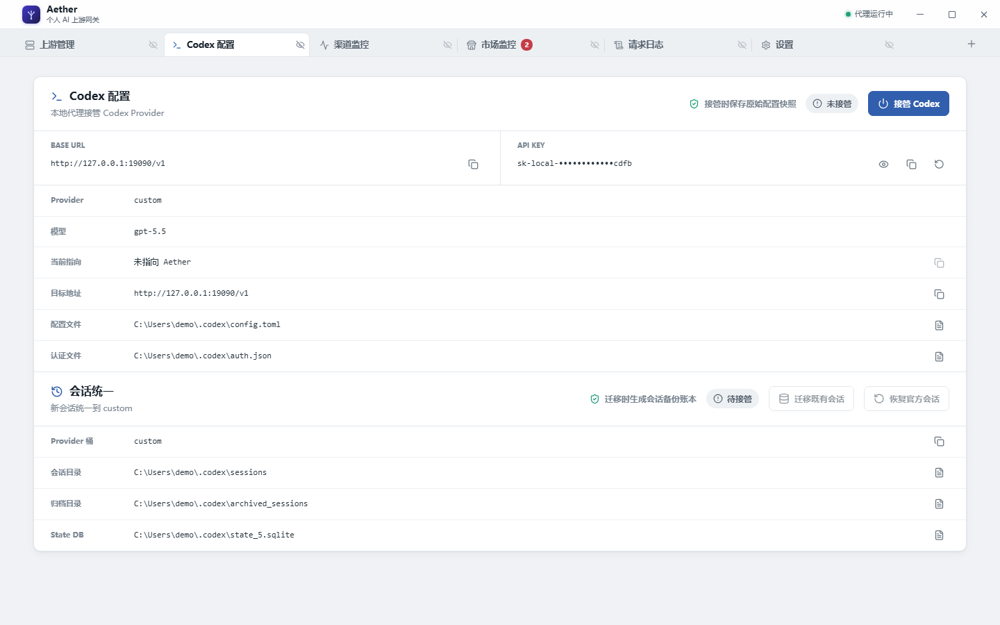

# Aether

Aether 是一款面向个人开发者的 Windows 本地 OpenAI/Codex 多上游桌面网关。它把 **OpenAI/Codex OAuth 账号池**与 **OpenAI 兼容 API Key 中转站**放进同一个调度池，向 Codex 和其他 OpenAI 兼容客户端提供稳定的本地 API 入口。

Aether 同时提供上游管理、Codex 配置接管、渠道监控、请求日志、链动小铺市场监控、系统通知和应用内网页标签页。当前版本为 `0.1.0-alpha.3`，仍处于早期测试阶段，配置格式和交互可能继续调整。

> Aether 聚焦个人本机使用，不是公网中转站、计费平台或多租户 SaaS。当前发布流程只构建 Windows x64 NSIS 安装包；macOS/Linux 兼容性尚未完成验证。

> 账号凭据目前仍以明文保存在当前用户的本地 SQLite 数据库中。请先阅读[数据、网络与安全边界](#数据网络与安全边界)，不要把应用数据目录或导出的备份文件公开上传。

## 目录

- [产品定位](#产品定位)
- [安装与快速开始](#安装与快速开始)
- [应用页面总览](#应用页面总览)
- [核心能力与当前边界](#核心能力与当前边界)
- [上游导入与管理](#上游导入与管理)
- [路由、故障切换与接口边界](#路由故障切换与接口边界)
- [Codex 配置与会话统一](#codex-配置与会话统一)
- [市场监控](#市场监控)
- [应用内网页标签页](#应用内网页标签页)
- [请求日志与渠道监控](#请求日志与渠道监控)
- [桌面设置、托盘与更新](#桌面设置托盘与更新)
- [数据、网络与安全边界](#数据网络与安全边界)
- [源码开发与构建](#源码开发与构建)
- [后续方向](#后续方向)
- [借鉴与致谢](#借鉴与致谢)
- [免责声明](#免责声明)

## 产品定位



客户端只需保存 Aether 界面显示的本地 Base URL 和 API Key。账号刷新、模型匹配、请求分配、故障冷却和上游维护都由桌面应用在本机完成。

Aether 没有自营云同步服务，但“本地优先”不等于离线：代理请求会发送到被选中的 OpenAI/Codex 或第三方中转站；市场监控、应用更新和应用内网页也会访问对应的外部服务。

## 安装与快速开始

### 使用 Windows 安装包

从 [GitHub Releases](https://github.com/hotcrush/Aether_api/releases/latest) 下载最新 Windows 安装包。首次启动后：

1. 在“上游管理”导入 OpenAI/Codex OAuth 账号，或添加 OpenAI 兼容中转站。
2. 在“Codex 配置”页顶部复制本地 Base URL 和 API Key。
3. 将它们填入 Codex 或其他 OpenAI 兼容客户端。
4. 发送一次请求，再到“请求日志”或“渠道监控”确认实际路由结果。

默认地址为：

```text
正式安装版 Base URL: http://127.0.0.1:9090/v1
开发/调试版 Base URL: http://127.0.0.1:19090/v1
API Key:              以 Aether 界面实际显示的 sk-local-... 为准
```

可以用 Models 接口检查本地代理：

```powershell
curl.exe "http://127.0.0.1:9090/v1/models" `
  -H "Authorization: Bearer <Aether 本地 API Key>"
```

本地代理业务请求同时接受 `Authorization: Bearer ...` 和 `x-api-key`。`/health` 健康检查与 CORS `OPTIONS` 预检不要求本地 Key，其余转发请求必须认证。

### 接入 Codex

最省事的方式是在“Codex 配置”页点击“接管 Codex”。Aether 会把当前用户的 Codex Provider 指向本地代理，并保留接管前的本机配置用于恢复。详情见 [Codex 配置与会话统一](#codex-配置与会话统一)。

## 应用页面总览

应用以工作区标签页组织功能。六个内置页面都位于窗口顶部，隐藏后可以通过右侧 `+` 菜单重新打开。

| 页面 | 现有能力 |
| --- | --- |
| 上游管理 | 代理状态与全局统计、OAuth/API Key 上游、搜索筛选、导入导出、用量、启停、连接测试、优先级、并发容量、回收站 |
| Codex 配置 | Provider 接管与恢复、本地 Base URL/API Key、会话迁移、按备份账本恢复官方会话 |
| 渠道监控 | 24 小时/7 天可用率、首包延迟、失败、估算费用、容量和最近观测，支持手动轻量检测 |
| 市场监控 | 商品比价、店铺状态、行情分析、提醒规则、未读事件和系统通知 |
| 请求日志 | 按状态与关键字筛选真实上游尝试，查看渠道、路由、Token、费用、首包和总耗时 |
| 设置 | 开机自启动、版本信息、回收站入口和反馈邮件模板 |

### 上游管理



### 渠道监控



### 市场监控



### 请求日志



### Codex 配置



## 核心能力与当前边界

| 模块 | 已提供 | 当前边界 |
| --- | --- | --- |
| 本地桌面网关 | Tauri 2 + Rust + Axum + React + SQLite；应用启动时自动启动本地代理 | 只绑定 `127.0.0.1`，不提供 TLS 或远程多用户服务 |
| OpenAI/Codex OAuth | 多账号导入、手动 PKCE 授权、刷新、额度、Responses/Models 转发 | 当前只支持 OpenAI/Codex，不支持 Claude/Gemini Provider |
| API Key 中转站 | 多站点接入、兼容路径转发、用量查询、站点快速打开、成本倍率同步 | 转发能力取决于中转站；倍率同步仅兼容 Sub2API 账单协议 |
| 混合调度 | 模型白名单、优先级、平滑加权、会话粘性、容量、速率限制、分类冷却、可选成本保护 | 单个请求最多尝试 3 个上游，并受 30 秒启动预算限制；不保证请求零中断 |
| 用量与费用 | OAuth 5 小时/7 天窗口、中转站消费/余额、Token 分项、费用估算 | 上游未返回或格式不兼容时无法展示；未知模型 Token 不计价；本地估算不是账单 |
| 每日预算 | 设置全局每日 USD 参考预算，并显示当天估算消费和剩余金额 | 仅作参考展示；超出后剩余显示为 0，不会自动停用账号、阻断请求或按预算选站 |
| 请求日志与监控 | 真实请求尝试、手动 Models 检测、24h/7d 汇总、30 天日志保留 | 不在后台定时发送额外付费模型请求；本机统计不代表上游全局 SLA |
| Codex 生态 | Provider 接管/恢复、会话 Provider 统一、备份账本 | 会读写当前用户的 Codex 配置、JSONL 会话和状态数据库 |
| 应用内网页 | 中转站、市场商品/店铺和网页新窗口在内部 Tab 打开 | 仅支持 HTTP(S)；网页 Tab 重启后不恢复；没有地址栏及前进、后退、刷新工具栏 |
| 市场监控 | 链动小铺商品/店铺采集、比价、行情、事件和桌面通知 | 当前只支持 `liandx/ldxp`；分类和价格信号属于本地规则，不构成商品鉴定或购买建议 |
| 凭据保护 | 普通账号列表只向前端提供脱敏凭据；导入候选只显示脱敏摘要 | 凭据当前仍明文保存于本地 SQLite；Stronghold 后端尚未接入日常账号读写流程 |

## 上游导入与管理

### 支持的导入内容

Aether 当前可解析：

- Codex `auth.json` 风格 JSON。
- CPA Codex JSON。
- OpenAI OAuth `access_token` / `refresh_token` 数据。
- OpenAI API Key 和 Base URL。
- Sub2API 单账号 JSON。
- Sub2API `sub2api-data` 备份。
- 多行 Token 文本。

导入窗口支持 JSON 文件、多文件拖放和粘贴文本；文件选择一次最多 20 个 JSON，粘贴文本作为一份内容处理，单份内容上限 10 MB。同一身份会更新凭据，不同 ChatGPT 用户、账号或不同 Base URL 的中转站会保留为独立条目。

剪贴板和应用内网页下载采用更严格的自动识别规则：只在发现完整且受支持的 CPA/Sub2API JSON 后生成候选，前端只收到脱敏摘要，用户确认后才会导入。普通网页文本、零散 Token 或不完整 JSON 不会静默写入账号池。

### 添加 OpenAI 账号（手动授权）

在“上游管理”点击“添加账号”，按 3 步完成：

1. 输入显示名称和优先级，生成 OpenAI 授权链接。
2. Aether 会自动打开系统浏览器；在 OpenAI 页面登录并确认授权。
3. OpenAI 跳转到 `http://localhost:1455/auth/callback` 后，Aether 会自动兑换令牌并创建账号。

授权使用 PKCE。临时授权会话只保存在应用内存中，30 分钟后失效；本机只监听回环地址 `127.0.0.1` / `::1` 的 1455 端口，回调中的 `state` 会在兑换令牌前校验。若该端口已被其他程序占用，Aether 会在生成授权链接前提示处理端口占用。

如本机运行了代理软件，可在“设置 → 出站代理”开启 Aether 的出站代理；默认地址为 `http://127.0.0.1:7890`。它会立即用于 OAuth 令牌兑换、刷新、额度查询、账号检测和本地中转上游请求，无需虚拟网卡。系统浏览器显示的 OpenAI 授权页仍按浏览器或系统代理连接。

### 添加中转站

在“上游管理”点击“添加中转站”，填写：

- 名称。
- API Key。
- Base URL，例如 `https://api.example.com/v1`。
- 模型白名单，例如 `gpt-5,gpt-5-mini`；留空表示允许全部模型。
- 优先级 `0-1000`，数字越小越优先。
- 权重 `1-1000`，用于同一优先级内的新请求分配。

如果站点实现了当前兼容的 Bearer `GET /v1/usage`，Aether 可以展示消费、限额、订阅或钱包余额；用量接口不兼容不会阻止正常 API 转发。

中转站可设置 `0-100` 的“成本倍率”，用于记录该站的实际相对成本。对于 Base URL 已配置的 API Key 中转站，开启“自动”后会每 30 分钟请求 `<Base URL>/v1/sub2api/billing`（Base URL 已包含 `/v1` 时不会重复添加）读取 `resolved_rate_multiplier`；可用刷新按钮立即同步。自动同步不会写入 0 倍率，需将“自动”关闭后才能手动调整倍率。

“打开中转站网页”会先把 API Base URL 规范化为站点首页：移除用户名和密码、路径、查询参数、Fragment，并尝试去掉主机名前缀 `api.`，随后在应用内网页 Tab 打开。

### 管理与回收站

上游列表支持：

- 搜索、OAuth/API Key 类型筛选和启用状态筛选。
- 启用/停用、连接测试、OAuth 手动刷新和用量查询。
- 为全部已启用上游的 OAuth 额度与中转站用量查询设置 5/15/30/60 分钟自动刷新开关和间隔。
- 修改优先级、并发容量和成本倍率。
- 批量刷新 OAuth、批量查询用量、清理报错上游。
- 导出包含完整凭据和路由配置的 Sub2API 备份。

删除上游会把它停用并移入回收站，因此它会立即退出调度。回收站可恢复上游，也可永久删除单项或清空全部；恢复后上游重新启用并参与路由。

> 导出的备份包含完整 OAuth Token、API Key、模型白名单、优先级、权重、并发和成本倍率配置，应按密码文件保管。

## 路由、故障切换与接口边界

### 新请求如何选择上游

对于尚未建立会话粘性的请求，路由顺序为：

1. 只保留已启用、未删除且支持当前端点与模型的上游。
2. 跳过正在冷却、达到本地速率限制或并发容量已满的上游。
3. 若设置中开启“成本保护”，再跳过成本倍率高于“最高成本倍率 × (1 − 安全缓冲)”的上游。
4. 优先使用数字更小的优先级。
5. 同一优先级内按权重执行平滑加权轮询。
6. 当前上游在响应提交前失败时，在剩余启动预算内尝试备用上游。

模型白名单不区分大小写并支持 `*` 通配符；留空表示允许全部模型。OAuth 和 API Key 中转站共用相同的本地容量注册表。

### 会话粘性

Aether 会识别请求头或 JSON 中的 `session_id`、`conversation_id` 和 `prompt_cache_key`。一旦会话绑定到某个渠道，只要该渠道仍可用，它会优先于普通优先级排序继续承接该会话，包括绑定渠道位于较低优先级的情况。

绑定渠道冷却、满载或不再匹配能力时，请求才会尝试其他渠道。新的无粘性请求仍按正常优先级和权重分配。

### 冷却与故障切换

Aether 会针对 `401-403`、`408`、`429`、带模型信息的 `404`、`5xx` 和传输错误应用账号级或模型能力级冷却，`429` 优先遵循有效的 `Retry-After`。OAuth Token 在请求前发现即将到期时会刷新，同一账号的并发刷新请求会合并处理；收到未授权响应后也会尝试强制刷新一次。

每个请求最多尝试 3 个上游，且响应启动阶段总预算为 30 秒。流式响应的首个有效载荷一旦提交给客户端，后续断流无法无损切换并重放；Aether 会记录错误并暂时隔离对应渠道。

### 当前接口范围

| 上游类型 | 支持的请求 |
| --- | --- |
| OpenAI/Codex OAuth | `/v1/responses`、`/responses`、Responses 的 `/compact` 和 `/input_tokens`、`/v1/models`、`/models` 及对应 Codex backend 别名 |
| API Key 中转站 | Responses/Models 规范路径，以及中转站自身支持的其他 OpenAI 兼容路径 |

Chat Completions 等非 Responses 路径当前只会交给 API Key 中转站，不会交给 OpenAI/Codex OAuth 账号。

Responses SSE 会流式透传；OAuth 上游返回流式事件而客户端请求非流式时，Aether 可以聚合最终响应。统计会尽量记录输入、输出、缓存读取、缓存写入和推理 Token，并按响应模型的本地价格快照估算费用；未知模型会明确标记为未计价。

## Codex 配置与会话统一

### Provider 接管与恢复

“接管 Codex”会读取当前用户的 `~/.codex/auth.json` 和 `~/.codex/config.toml`，在本地数据库保存接管前快照，然后把 Codex Provider 指向 Aether 当前代理地址。新会话使用 `custom` Provider 桶。

“恢复 Codex”会按接管快照恢复原有配置。重置 Aether 本地 API Key 时，如果 Codex 仍处于接管状态，Aether 会同步更新接管配置中的 Key。

### 既有会话迁移

“迁移既有会话”会处理当前用户的：

- `~/.codex/sessions/**/*.jsonl`
- `~/.codex/archived_sessions/**/*.jsonl`
- `state_5.sqlite`，以及 Codex 配置或环境中指向的状态数据库

迁移会把既有 `openai` / `aether` Provider 记录改到 `custom`，并在 Aether 应用数据目录的 `backups` 下生成文件备份和恢复账本。

“恢复官方会话”只恢复备份账本中原本属于 `openai` 的会话，不会把原本属于其他 Provider 的记录误改回官方渠道。执行前仍建议自行备份重要 Codex 会话。

## 市场监控

“市场监控”是一个顶级工作区 Tab，内部合并了“商品比价”“店铺状态”“行情分析”和“提醒”四个分区。该模块当前只支持链动小铺 `liandx/ldxp` 数据源。

### 采集范围与保护

- 新建 `market.db` 时会加入 22 家默认店铺；用户可以添加、编辑、暂停、启用或删除店铺。
- 正常采集成功后约 90 秒进入下一轮；手动刷新有 30 秒冷却。
- 店铺请求采用有限并发、请求间隔、分页、资料/费率缓存以及主备 API。
- 连续失败、`403`、`429` 或安全校验会触发店铺退避或全局熔断；保护期间继续显示已有缓存，并按恢复时间重试。
- 商品连续两次未出现后才确认售罄，降低短暂接口缺项造成的误报。

轮询间隔会因失败退避和熔断而延长，因此市场数据属于周期性近实时采集，不是交易所级实时行情。

### 商品比价

商品页只展示当前有货商品，并提供：

- K12、GPT Plus、BUG TEAM、重点分类和全部分类。
- 分类比价、按店铺和全部商品三种浏览方式。
- 低价、合理价内、全部价格，以及自定义到手价区间。
- 商品名、店铺名、来源分类与匹配词搜索。
- GPT Plus 已接码、未接码、未知筛选。
- 每页 30 条的分页展示。

同名商品会合并展示，保留当前最低到手价，并标注同名报价数和汇总库存。到手价由商品价和可识别的买方手续费组成。

K12、GPT Plus、BUG TEAM、接码状态和价格层来自商品名称与当前市场样本的本地规则，可能存在误分类；它们不是商品真实性、账号质量或未来价格的保证。

点击商品会在应用内打开 `market-product:<商品 ID>` 网页 Tab；同一商品重复点击会激活已有 Tab。

### 店铺状态

店铺页展示启用状态、采集健康、商品数、总库存、最近成功时间、冷却时间和错误摘要。店铺 token 是店铺链接最后一段，例如 `pay.ldxp.cn/shop/echo_dream` 中的 `echo_dream`。

“打开店铺”使用 `market-shop:<店铺 token>` 复用键在应用内网页 Tab 打开；暂停店铺后，其已有商品会从后续采集结果中移除。

### 行情分析

行情页支持 24 小时、7 天和 30 天范围，展示：

- 总库存时序走势。
- 当前商品数和总库存。
- 各关注分类的当前总库存、加权均价和最低价。
- 集中补库、疑似扫货和高低价格信号。

行情样本默认保留约 31 天，市场事件默认保留约 90 天。

### 提醒与系统通知

市场事件始终写入提醒历史并保留未读状态；提醒页的开关和规则只决定是否发送 Windows 桌面通知。可配置项包括：

- 桌面通知总开关和系统通知开关。
- K12、GPT Plus 到货；两个通知开关均启用时固定生效，不设单独规则开关。
- BUG TEAM 到货。
- 连续确认后的商品售罄。
- 店铺异常与恢复。
- 集中补库和疑似扫货。
- 明显低价或高价信号。
- 跨午夜生效的静默时段。

提醒历史按每页 15 条展示，可筛选全部/未读以及售罄/补货事件。静默时段仍会记录事件和未读状态，只是不发送系统通知。系统通知需要操作系统授权；通知成功显示后才记录发送时间。点击通知会恢复并聚焦 Aether，打开市场监控对应分区并把该事件标为已读。

### 旧版 codex-relay 市场数据迁移

首次初始化市场数据库时，Aether 会尝试从当前用户文档目录下的 `GitHub/codex-relay/server/data` 导入旧商品快照、行情点和事件，也可以通过 `CODEX_RELAY_DATA_DIR` 指定来源目录。迁移只执行一次；历史事件按已读导入，避免首次启动产生大量未读通知。

## 应用内网页标签页

Aether 在主窗口中创建独立原生 WebView，用于打开：

- API Key 中转站首页。
- 市场商品、店铺和带商品 URL 的市场提醒。
- Aether 主界面中的其他 HTTP(S) 链接。
- 网页请求的新窗口链接；弹窗会改为新的应用内 Tab。

同一中转站、市场商品或店铺通过复用键避免重复开页。关闭网页 Tab 会销毁对应 WebView；应用只在 `localStorage` 中保存内置页面的顺序、可见状态和当前页，重启后不恢复网页 Tab。

WebView 会记录复制/剪切和 Clipboard API 写入事件，并在复制后检查本机剪贴板是否包含完整、受支持的 CPA/Sub2API JSON。下载完成后也会扫描不超过 10 MB 的 UTF-8 文件。识别成功只生成脱敏候选，仍需用户确认；Aether 不会把剪贴板或下载文件主动上传到自营服务。

### 标签页快捷键

| 快捷键 | 行为 |
| --- | --- |
| `Ctrl+Tab` / `Ctrl+PageDown` | 切换到下一个标签 |
| `Ctrl+Shift+Tab` / `Ctrl+PageUp` | 切换到上一个标签 |
| `Ctrl+T` | 打开内置页面选择器，不创建空白网址页 |
| `Ctrl+W` | 关闭当前网页 Tab；内置页面不会被此快捷键关闭 |
| `Ctrl+1` 至 `Ctrl+8` | 跳转到对应位置的标签 |
| `Ctrl+9` | 跳转到最后一个标签 |

标签可以拖动排序。内置页面使用眼睛按钮隐藏，至少会保留一个内置页面；网页页面使用关闭按钮销毁。标签获得键盘焦点时，还可以用方向键、`Home` 和 `End` 移动焦点。

## 请求日志与渠道监控

### 请求日志

每次真实上游尝试都会写入本地结构化日志，包括：

- 请求 ID、尝试序号、上游名称和类型。
- HTTP 方法、规范化路径、端点族和模型。
- 状态、HTTP 状态码、首包时间和总耗时。
- 输入、输出、缓存和推理 Token，以及估算费用。
- 已限制长度并脱敏的错误摘要。

日志不保存请求/响应正文、完整凭据、查询参数或会话 ID。默认保留 30 天且最多 20,000 条；日志页支持关键字、状态筛选、分页、立即刷新和手动清空。

### 渠道监控

渠道监控复用真实请求日志，并提供用户主动触发的轻量 Models 连接检测。应用不会为了维持健康曲线在后台定时发送额外的付费模型请求。

- 成功且首包小于 6 秒：正常。
- 成功但首包达到 6 秒：降级。
- 重试或错误：异常。
- 客户端取消和仍在进行的请求：不进入可用率与时间线。

页面提供 24 小时/7 天可用率、平均首包、尝试、失败、估算费用、当前容量和最近观测。全局摘要只统计已启用渠道；已停用渠道仍保留在列表中供查看。

这些指标只反映本机经过 Aether 的实际流量和用户主动检测，不代表上游运营方的全局 SLA。无请求期间不会生成观测数据。

## 桌面设置、托盘与更新

- Aether 使用单实例运行；再次启动会恢复并聚焦已有窗口。
- 关闭主窗口会隐藏到系统托盘，不会立即停止本地代理；托盘菜单可显示窗口或完全退出。
- “设置”页可以启用 Windows 登录后的开机自启动。
- “设置 → 出站代理”默认提供 `http://127.0.0.1:7890`，支持 HTTP、HTTPS、SOCKS5/SOCKS5H，并会立即切换 Aether 的 OpenAI/上游出站请求。
- 设置页显示版本、commit 和构建时间，并提供回收站和反馈邮件模板入口。
- 启动后会静默检查 GitHub Releases 更新；点击标题栏版本号可以手动检查，发现更新后再次点击可下载安装。
- 大版本更新会显示强提示遮罩；更新可用性取决于 GitHub Release、签名和网络环境。

如果需要彻底停止代理，请使用托盘菜单“退出 Aether”，而不是只关闭窗口。

## 数据、网络与安全边界

### 本地保存的数据

Aether 使用当前用户的 Tauri 应用数据目录（应用标识 `com.siriu.aether`）：

- `sub2api.db`：账号、凭据、设置、请求日志、用量缓存、Codex 接管快照等。
- `market.db`：监控店铺、商品快照、行情样本、提醒规则与事件。
- `backups/`：Codex 会话迁移与恢复前的文件、数据库备份和账本。
- `vault.stronghold`：初始化 Stronghold 后使用的保险库文件；当前账号凭据日常读写尚未迁入该保险库。

账号完整 Token/API Key 不会通过普通账号列表序列化给 Web 前端，但它们当前仍以明文保存在 `sub2api.db`。导出的备份同样包含完整凭据。

### 会访问的外部服务

- 代理请求：OpenAI/Codex 或用户配置的第三方中转站。
- OAuth 额度：ChatGPT/Codex 用量接口。
- 中转站用量：用户配置站点的 `/v1/usage`；开启倍率同步的 Sub2API 中转站还会请求 `/v1/sub2api/billing`。
- 市场监控：链动小铺 `www.ldxp.cn` / `pay.ldxp.cn`。
- 应用更新：GitHub Releases。
- 应用内网页：用户打开的第三方 HTTP(S) 页面。

第三方中转站会接触其 API Key 和转发给它的请求内容。请只接入信任的站点，并自行了解其隐私、计费和留存政策。

### 本地代理边界

- 代理默认只监听 HTTP 回环地址，不提供 TLS；不要通过端口映射或反向代理直接暴露到局域网或公网。
- 当前 CORS 策略允许任意来源、方法和请求头。虽然除 `/health` 外均要求本地 Key，仍不要把该 Key 暴露给网页、浏览器扩展或日志。
- 正式版与开发版使用不同的代理端口配置，避免同时调试时互相覆盖。
- 成本保护默认关闭。开启后只按账号设置的成本倍率进行候选过滤，不会读取 OAuth 剩余额度、中转钱包余额、每日预算或本地估算成本自动选站。

### DNS 边界

代理、额度、中转站用量和市场采集使用 Rust HTTP 客户端内置的 Cloudflare `1.1.1.1/1.0.0.1` 与 Google `8.8.8.8/8.8.4.4` 公共 DNS，以减少本地 DNS 污染影响。

这些查询使用普通 UDP DNS，不是 DoH/DoT，也不覆盖系统 WebView、更新器或其他系统网络流量；在屏蔽公共 UDP 53 的网络中可能不可用。

### Codex 文件写入边界

Codex 接管会读写 `~/.codex/auth.json` 和 `~/.codex/config.toml`；会话统一会读写 `sessions`、`archived_sessions` 和 `state_5.sqlite`。Aether 会创建恢复快照或文件备份，但重要会话仍建议额外备份。

### 其他限制

- Sub2API 兼容当前聚焦账号字段子集，平台专用字段和代理配置不保证无损往返。
- 中转站用量解析不是通用站点探测协议。
- 市场分类、价格层、补库和扫货信号是本地统计规则，可能误判。
- 本地费用、额度和余额展示仅用于辅助观察，不是官方账单或结算凭证。

## 源码开发与构建

### 环境要求

- Windows x64。
- Node.js 22（推荐使用当前 CI 版本）。
- pnpm `10.14.0`。
- Rust stable 与 `x86_64-pc-windows-msvc` 工具链。
- [Tauri 2 Windows 前置依赖](https://v2.tauri.app/start/prerequisites/)，包括 MSVC 构建工具和 WebView2。

### 完整桌面开发

```powershell
pnpm install --frozen-lockfile
pnpm start
```

`pnpm start` 等价于 `pnpm tauri dev`，会同时启动 Vite 前端、Tauri 原生后端和开发代理 `127.0.0.1:19090`。

### 前端预览

```powershell
pnpm dev
```

前端预览运行在 `http://127.0.0.1:1420`。它使用内置预览数据，不会启动真实本地代理、原生通知、托盘或子 WebView，因此不能用来验证完整桌面能力。

### 构建命令

```powershell
# TypeScript 检查和前端生产构建
pnpm build

# Windows NSIS release 安装包
pnpm build:release

# Windows debug 桌面包
pnpm build:debug
```

当前 `tauri.conf.json` 只启用了 NSIS bundle 目标。Tauri 框架本身具备跨平台能力，不代表本仓库已经完成 macOS/Linux 构建、通知、托盘、WebView 和更新兼容性验证。

### 临时覆盖代理端口

可以在启动前设置：

- `AETHER_DEVELOPMENT_PROXY_PORT`：只覆盖开发/调试版。
- `AETHER_PRODUCTION_PROXY_PORT`：只覆盖正式版。
- `AETHER_PROXY_PORT`：通用后备覆盖。

端口必须是 `1024-65535`。当前设置页尚未提供持久化端口编辑入口。

## 后续方向

以下是方向性路线图，不代表发布日期或功能承诺：

- 把账号凭据日常读写迁入 Stronghold，加密现有数据库凭据并支持加密备份。
- 增加账号和中转站的完整编辑，以及代理端口、超时和路由参数设置。
- 继续扩展中转站用量适配、模型别名和字段兼容。
- 完善市场数据源兼容、分类准确性和提醒规则配置。
- 增加路由决策解释，以及额度、余额、延迟、错误率和成本感知策略。
- 评估应用内 OAuth 授权与 Claude、Gemini 等更多 Provider 协议。
- 完成 Windows 版本稳定性、自动更新和回滚验证，再评估 macOS/Linux 发布。

维护仍会坚持“本地优先、个人使用、最少依赖”的产品边界。

## 借鉴与致谢

Aether 在开发过程中研究了多个主流 AI 网关和账号池项目。当前实现为 Rust + Tauri 的独立本地应用，不是对下列项目的二进制封装，也不宣称兼容它们的全部功能。

| 项目 | 借鉴内容 | 许可证 |
| --- | --- | --- |
| [CLIProxyAPI](https://github.com/router-for-me/CLIProxyAPI) | 本地兼容 API、OAuth 多账号池、轮询调度、失败切换和 CLI 工具接入的产品思路 | MIT |
| [Sub2API](https://github.com/Wei-Shaw/sub2api) | 账号池与中转站统一管理、优先级/权重/模型路由、备份数据格式和用量展示思路 | LGPL-3.0-or-later |
| [CC Switch](https://github.com/farion1231/cc-switch) | Tauri 2 桌面端架构、本地代理热切换与熔断、Provider 一键切换交互、系统托盘和自动更新实践 | MIT |
| [New API](https://github.com/QuantumNous/new-api) | 多上游管理、模型路由、健康状态与运维交互的行业实践 | AGPL-3.0 |
| [LiteLLM](https://github.com/BerriAI/litellm) | 统一 OpenAI 接口、Provider 抽象、路由与可观测性思路 | MIT，企业目录另有许可 |
| [GPTSession2CPAandSub2API](https://github.com/gtxx3600/GPTSession2CPAandSub2API) | CPA Codex 账号字段的兼容解析参考 | MIT |

上表中的许可证信息以各上游仓库当前的 `LICENSE` 为准。“借鉴”主要指产品理念、交互流程、协议兼容目标和数据格式研究，不等同于对上述项目的完整派生或商业背书。

本仓库自身的复制、修改、分发和商用权利以仓库根目录实际发布的 `LICENSE` 为准；未提供 `LICENSE` 时，不代表自动授予这些权利。

## 免责声明

1. Aether 是独立开发的个人本地工具，与 OpenAI、ChatGPT、Codex、CLIProxyAPI、Sub2API、New API、LiteLLM、链动小铺及任何中转站运营方不存在官方隶属、合作、授权或背书关系。
2. 用户必须自行确保账号、订阅、API Key、请求内容和使用方式符合当地法律、上游服务条款及所属组织政策。使用订阅账号进行 API 转发可能受服务提供方限制。
3. 项目不保证上游可用性、账号安全、协议持续兼容、市场数据完整性或对特定用途的适用性。上游协议和网页接口变更可能导致刷新、额度、转发或市场采集暂时失效。
4. 因使用本项目导致的封号、限流、费用、凭据泄露、数据丢失、错误通知、购买决策、业务中断或其他直接/间接损失，应由用户自行承担风险。
5. 第三方中转站会接触 API Key 和请求内容，其隐私、计费、留存和服务质量由对应运营方负责；请只接入信任的站点。
6. OAuth 额度、中转站余额、本地费用估算和市场价格分析仅用于辅助展示，不是官方账单、结算凭证、商品鉴定或购买建议。
7. 各参考项目和第三方依赖继续适用其各自的版权与许可证。

本说明不构成法律、信息安全、计费或投资建议。在反馈问题或提供日志前，请先删除 Token、API Key、本地访问 Key、邮箱、账号 ID 和其他敏感信息。
