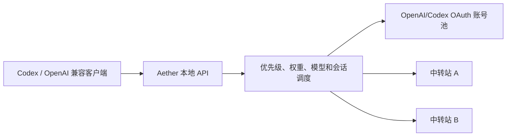

# Aether

Aether 是一款面向个人开发者的本地 OpenAI/Codex 多上游桌面网关。它把 **OpenAI/Codex OAuth 账号池**和 **OpenAI 兼容中转站**放进同一个调度池，向 Codex 及其他 OpenAI 兼容客户端提供一个稳定的本地 API 入口。

Aether 聚焦“个人本机上游管理”，不是公网中转站、计费平台或多租户 SaaS。当前版本为 `0.1.0`，仍在持续完善中。

> 当前主要在 Windows 环境开发和验证。Tauri 具备跨平台构建能力，macOS/Linux 安装包与完整兼容性仍属于后续验证范围。

## 目录

- [产品定位](#产品定位)
- [借鉴与致谢](#借鉴与致谢)
- [实现了什么](#实现了什么)
- [当前完成情况](#当前完成情况)
- [产品优点](#产品优点)
- [使用方法](#使用方法)
- [持续更新内容](#持续更新内容)
- [未来计划](#未来计划)
- [数据与安全说明](#数据与安全说明)
- [免责声明](#免责声明)

## 产品定位



客户端只需保存 Aether 显示的本地 Base URL 和 API Key。账号刷新、模型匹配、负载分配、故障切换和上游维护都在桌面应用中完成。

## 借鉴与致谢

Aether 在开发过程中研究了多个主流 AI 网关和账号池项目。当前实现为 Rust + Tauri 的独立本地应用，不是对下列项目的二进制封装，也不宣称兼容它们的全部功能。

| 项目 | 借鉴内容 | 许可证 |
| --- | --- | --- |
| [CLIProxyAPI](https://github.com/router-for-me/CLIProxyAPI) | 本地兼容 API、OAuth 多账号池、轮询调度、失败切换和 CLI 工具接入的产品思路 | MIT |
| [Sub2API](https://github.com/Wei-Shaw/sub2api) | 账号池与中转站统一管理、优先级/权重/模型路由、备份数据格式和用量展示思路 | LGPL-3.0-or-later |
| [New API](https://github.com/QuantumNous/new-api) | 多上游管理、模型路由、健康状态与运维交互的行业实践 | AGPL-3.0 |
| [LiteLLM](https://github.com/BerriAI/litellm) | 统一 OpenAI 接口、Provider 抽象、路由与可观测性思路 | MIT，企业目录另有许可 |
| [GPTSession2CPAandSub2API](https://github.com/gtxx3600/GPTSession2CPAandSub2API) | CPA Codex 账号字段的兼容解析参考 | MIT |

上表中的许可证信息以各上游仓库当前的 `LICENSE` 为准。“借鉴”主要指产品理念、交互流程、协议兼容目标和数据格式研究，不等同于对上述项目的完整派生或商业背书。

## 实现了什么

### 本地桌面网关

- 基于 Tauri 2、Rust、Axum、React 和 SQLite，启动桌面应用时自动启动本地代理。
- 正式版默认监听 `127.0.0.1:9090`，开发/调试版使用独立的 `127.0.0.1:19090`；首次启动自动生成 `sk-local-...` 本地 API Key。
- 支持 Bearer Token 和 `x-api-key` 认证，可在界面中显示、复制和重置本地 Key。
- 关闭主窗口后隐藏到系统托盘，可通过托盘恢复窗口或完全退出。

### 账号池与中转站

- OpenAI/Codex OAuth 账号池和 OpenAI 兼容 API Key 中转站可同时存在、同时启用。
- 多账号不是单例：导入会累积账号，只有识别为同一身份时才更新凭据。
- 中转站按“API Key + Base URL”识别，同一 Key 在不同站点不会互相覆盖。
- 支持启停、测试、删除、优先级编辑、搜索、类型/状态筛选和批量清理报错上游。
- 中转站可一键使用系统默认浏览器打开站点首页，自动清除前缀为 `api.` 的子域名、API 路径、查询参数和认证信息。

### 导入、更新与备份

- 支持 Codex `auth.json` 风格、CPA Codex JSON、OAuth Token、OpenAI API Key、Sub2API 单账号和 Sub2API 备份。
- 支持 JSON 文件、多文件拖放、粘贴文本和多行 Token 导入；一次最多处理 20 份内容。
- 窗口获得焦点时可识别剪贴板中完整的 CPA/Sub2API JSON，展示脱敏摘要并在用户确认后导入。
- 剪贴板候选只能消费一次，相同内容不重复弹窗，Token 不会随候选摘要发送给 Web 前端。
- 备份导出保留 OAuth/API Key 凭据、优先级、模型白名单和权重，可用于迁移和恢复。

### 调度与故障切换

- 按优先级分层，数字越小越优先；高优先级不可用时才进入下一层。
- 同一优先级内使用平滑加权轮询，权重范围为 `1-1000`。
- 支持模型白名单和不区分大小写的 `*` 通配符；留空表示允许全部模型。
- 识别 `session_id`、`conversation_id` 和 `prompt_cache_key` 做会话粘性，且粘性不会越过更高优先级。
- 对 `401-403`、`408`、`429`、带模型的 `404` 和 `5xx` 执行分类冷却与自动切换；`429` 优先遵循 `Retry-After`。
- OAuth Token 在到期前自动刷新，同一账号的并发刷新会合并处理，也支持单个或批量手动刷新。

### 协议、流式与统计

- OAuth 账号支持 Responses、Responses Compact、Input Tokens 和 Models 路径。
- API Key 中转站会规范化 Responses/Models 路径，其他 OpenAI 兼容路径按原路径转发。
- 支持 Responses SSE 流式透传；OAuth 上游为流式时，可为非流式客户端聚合最终响应。
- 记录输入、输出、缓存读取、缓存写入和推理 Token，并按响应模型的分项价格估算费用；未知模型明确标记为未计价。
- 提供账号并发容量（当前活跃请求 / 上限），满载时自动尝试下一个账号；OAuth 与中转站使用同一套本地容量调度。
- OpenAI/Codex OAuth 账号可查询 5 小时/7 天窗口用量、剩余百分比和重置时间。
- 实现兼容中转站的 Bearer `GET /v1/usage` 查询，可解析限额、订阅和钱包模式，展示今日/近 30 天消费、额度、余额和套餐。

### 请求日志与渠道监控

- 每次真实上游尝试都会写入本地结构化请求日志，记录渠道、路由、状态、首包延迟、总耗时、Token 和估算费用，不保存请求/响应正文、凭据、查询参数或会话 ID。
- 渠道监控复用上述真实流量，并允许用户手动执行一次轻量连接检测；应用不会在后台定时发送额外的付费模型请求。
- 成功且首包小于 6 秒视为正常，成功但首包达到 6 秒视为降级，重试或错误视为异常；客户端取消和仍在进行的请求不进入可用率与时间线。
- 提供最近 24 小时和 7 天的可用率、平均首包、失败次数、估算费用及最近观测时间线，同时展示当前活跃请求与账号并发上限。
- 全局摘要只统计已启用渠道，已停用渠道仍保留在列表中供查看；请求日志默认保留 30 天且最多 20,000 条。

### 生态接入

- Codex 配置页可一键将 Codex Provider 接管到 Aether 本地代理，并可恢复接管前配置。
- Codex 新会话统一使用 `custom` Provider 桶，可迁移既有 `openai`/`aether` 会话并按备份账本恢复官方会话。
- 普通账号列表只返回脱敏凭据，不会把完整上游 Token/API Key 序列化给 Web 前端。

## 当前完成情况

| 模块 | 状态 | 当前边界 |
| --- | --- | --- |
| Tauri 桌面端与本地代理 | 已完成 | 正式版 `9090`、开发版 `19090`，配置相互隔离 |
| OpenAI/Codex OAuth 多账号池 | 已完成 | 当前专注 Responses 和 Models |
| OpenAI 兼容中转站 | 已完成 | 由 Base URL + API Key 接入 |
| 账号池 + 中转站混合调度 | 已完成 | 共同承接能力匹配的 Responses/Models 请求 |
| 优先级、权重、模型、粘性与冷却 | 已完成 | 基于本机内存调度状态 |
| 多格式导入、剪贴板确认与备份导出 | 已完成 | 导出文件包含完整凭据 |
| OAuth 额度与中转站用量 | 已完成 | 数据可用性取决于上游接口 |
| 请求日志与渠道监控 | 已完成 | 真实流量 + 手动检测，不做后台付费探活 |
| 托盘、状态开关、站点快速打开和 Codex 接管 | 已完成 | 站点使用系统默认浏览器打开 |
| Codex 会话统一 | 已完成 | 新会话进入 `custom` 桶，既有历史可显式迁移和恢复 |

## 产品优点

- **一个入口同时使用两类资源**：订阅账号池与 API 中转站不需要在客户端反复切换。
- **调度可控**：优先级、权重、模型白名单、会话粘性和故障冷却可组合使用，不只是随机轮询。
- **轻量本地化**：无需 PostgreSQL、Redis 或独立服务器，账号、配置和统计存在本机 SQLite。
- **迁移成本低**：兼容常见 Codex、CPA 和 Sub2API 数据，重复导入更新凭据而不是替换整个池。
- **故障处理细粒度更高**：账号级与模型能力级冷却分开，避免单个模型故障长时间误伤整个上游。
- **桌面运维效率高**：导入、测试、额度、启停、筛选、备份和故障清理集中在一个界面。
- **凭据最小暴露**：代理只监听本机，普通列表和剪贴板确认弹窗只展示脱敏信息。

## 使用方法

### 1. 运行项目

开发环境需要 Node.js、pnpm、Rust 以及 [Tauri 2 对应平台依赖](https://v2.tauri.app/start/prerequisites/)。

```powershell
pnpm install
pnpm tauri dev
```

构建桌面安装包：

```powershell
pnpm tauri build
```

### 2. 导入 OAuth 账号池

点击“导入上游”，选择 JSON 文件、拖放多个文件或粘贴内容。也可先复制完整的 CPA/Sub2API JSON，再激活 Aether 窗口，应用会弹出脱敏确认框。

已存在的同一账号会更新凭据；不同用户、不同 ChatGPT 账号或不同中转站会保持为独立条目。

### 3. 添加中转站

点击“添加中转站”，填写：

- 名称。
- API Key。
- Base URL，例如 `https://api.example.com/v1`。
- 模型白名单，例如 `gpt-5,gpt-5-mini`；留空表示全部模型。
- 优先级 `0-1000`，数字越小越优先。
- 权重 `1-1000`，用于同一优先级内的流量分配。

如果站点实现了当前兼容的 `GET /v1/usage`，Aether 会自动读取消费、限额或钱包余额；不兼容时仍可正常转发 API 请求。

### 4. 接入客户端

应用顶部会显示实际 Base URL 和本地 API Key。默认值为：

```text
Base URL: http://127.0.0.1:9090/v1
API Key:  以 Aether 界面实际显示为准
```

将这两项填入 OpenAI 兼容客户端。Codex 可在“Codex 配置”页点击“接管 Codex”，Aether 会把当前用户的 Codex Provider 指向本地代理，并让新会话进入 `custom` Provider 桶；点击“恢复 Codex”会还原接管前配置。也可使用下列命令验证：

```powershell
curl.exe "http://127.0.0.1:9090/v1/models" -H "Authorization: Bearer <Aether 本地 API Key>"
```

以上示例使用正式版默认端口；`tauri dev` 和 debug 构建请改用 `19090`。也可通过 `AETHER_DEVELOPMENT_PROXY_PORT`、`AETHER_PRODUCTION_PROXY_PORT` 或通用的 `AETHER_PROXY_PORT` 临时覆盖，后续会在设置页开放持久化自定义端口。

“Codex 配置”的会话统一区可把既有 `~/.codex/sessions`、`~/.codex/archived_sessions` 和 `state_5.sqlite` 中的 `openai`/`aether` 历史迁入 `custom` 桶；恢复官方会话只处理迁移备份账本中原本属于 `openai` 的历史。

### 5. 路由规则

- 优先使用数字更小的优先级。
- 同一优先级按权重平滑分配请求。
- 模型必须匹配该上游的白名单。
- 连续会话优先继续使用原上游。
- 上游鉴权、限流、模型或服务错误时，当前请求会尝试切换到其他可用上游。

### 6. 当前接口边界

| 上游类型 | 支持的请求 |
| --- | --- |
| OpenAI/Codex OAuth | `/v1/responses`、`/responses`、Responses 的 `/compact` 和 `/input_tokens`、`/v1/models`、`/models` 及对应 Codex backend 别名 |
| API Key 中转站 | Responses/Models 规范路径，以及中转站支持的其他 OpenAI 兼容路径 |

Chat Completions 等非 Responses 路径当前只会交给 API Key 中转站，不会交给 OpenAI/Codex OAuth 账号。

## 持续更新内容

Aether 的持续维护将优先围绕下列方向：

- 跟进 OpenAI/Codex 上游协议、请求头、流式事件和 OAuth 刷新变化。
- 维护 Codex、CPA 和 Sub2API 导入格式，降低账号迁移成本。
- 扩展常见中转站的用量、限额、订阅和钱包响应兼容。
- 改进错误分类、冷却时间、渠道监控和故障切换准确性。
- 更新 Tauri、Rust、React 与网络依赖，持续收紧本地凭据和链路安全。
- 完善桌面交互、数据迁移和故障提示，保持日常操作简短直接。

持续更新仍会坚持“本地优先、个人使用、最少依赖”的产品边界。

## 未来计划

以下是方向性路线图，不代表确定发布日期或功能承诺。

| 阶段 | 计划 |
| --- | --- |
| 近期 | 使用系统凭据库或本机加密保护 Token/API Key，提供加密备份 |
| 近期 | 增加账号和中转站完整编辑，将已分环境持久化的代理端口、DNS、超时与路由参数开放到设置界面 |
| 中期 | 增加配额、余额、延迟和错误率感知的自适应调度，支持成本上限策略 |
| 中期 | 增加路由决策解释、健康评分、告警规则和更长周期的故障趋势 |
| 中期 | 引入可扩展的中转站用量适配器和模型别名/映射规则 |
| 长期 | 增加应用内 OAuth 授权流程，并评估 Claude、Gemini 等更多 Provider 协议 |
| 长期 | 完善 Windows、macOS 和 Linux 安装包验证、自动更新与版本回滚 |

## 数据与安全说明

- 账号凭据目前以明文存放在当前用户的 Tauri 应用数据目录 SQLite 中，尚未接入系统凭据库。
- 导出的 Sub2API JSON 备份包含完整 OAuth Token 和 API Key，应按密码文件保管，不要上传到公开网盘、Issue 或日志。
- 代理默认只监听本机 HTTP 回环地址，不提供 TLS；不要通过端口映射或反向代理直接暴露到局域网或公网。
- 除 `/health` 外的代理路径需要本地 Key，但当前 CORS 策略较宽松；不要向网页、浏览器扩展或日志泄露该 Key。
- “本地优先”不等于离线运行：请求内容会发送到调度选中的 OpenAI/Codex 或第三方中转站。
- Codex 接管会读写当前用户的 `~/.codex/config.toml`，并把接管前的 `auth.json` 与 `config.toml` 快照保存在本机应用数据库中用于恢复。
- Codex 会话统一会读写当前用户的 `~/.codex/sessions/**/*.jsonl`、`~/.codex/archived_sessions/**/*.jsonl` 和 `state_5.sqlite`；迁移与恢复前的文件备份保存在应用数据目录的 `backups` 下。
- Sub2API 兼容当前聚焦账号字段子集，代理配置和平台专用字段不保证无损往返。
- 中转站用量读取仅尝试 Bearer `GET /v1/usage` 和当前已兼容的字段，并非通用的站点探测协议。
- 请求日志和渠道监控数据仅保存在本机 SQLite；它们不包含请求/响应正文或凭据，但可能包含模型、路由、时间、状态、Token、费用和已脱敏错误摘要。
- 渠道可用率来自本机实际流量与用户主动检测，不代表上游的全局 SLA；无请求期间不会生成观测数据。
- 当前调度不会根据剩余额度、钱包余额或估算成本自动选站。
- 流式响应的首个有效载荷一旦返回给客户端，后续流错误无法无损切换并重放，Aether 会记录错误并冷却对应上游。

## 免责声明

1. Aether 是独立开发的个人本地工具，与 OpenAI、ChatGPT、Codex、CLIProxyAPI、Sub2API、New API、LiteLLM 及任何中转站运营方不存在官方隶属、合作、授权或背书关系。
2. 用户必须自行确保账号、订阅、API Key、请求内容和使用方式符合当地法律、上游服务条款及所属组织政策。使用订阅账号进行 API 转发可能受服务提供方限制。
3. 项目不保证上游可用性、账号安全、协议持续兼容、数据完整性或对特定用途的适用性。上游协议变更可能导致刷新、额度或转发功能暂时失效。
4. 因使用本项目导致的封号、限流、费用、凭据泄露、数据丢失、业务中断或其他直接/间接损失，应由用户自行承担风险。
5. 第三方中转站会接触 API Key 和请求内容，其隐私、计费、留存和服务质量由对应运营方负责；请只接入信任的站点。
6. OAuth 额度、中转站余额和本地费用估算仅用于辅助展示，不是官方账单、结算凭证或购买建议。
7. 各参考项目和第三方依赖继续适用其各自的版权与许可证。本仓库自身的复制、修改、分发和商用权利以仓库根目录实际发布的 `LICENSE` 为准；未提供 `LICENSE` 时，不代表自动授予这些权利。

本说明不构成法律、信息安全或计费建议。在反馈问题或提供日志前，请先删除 Token、API Key、本地访问 Key、邮箱和账号 ID。
